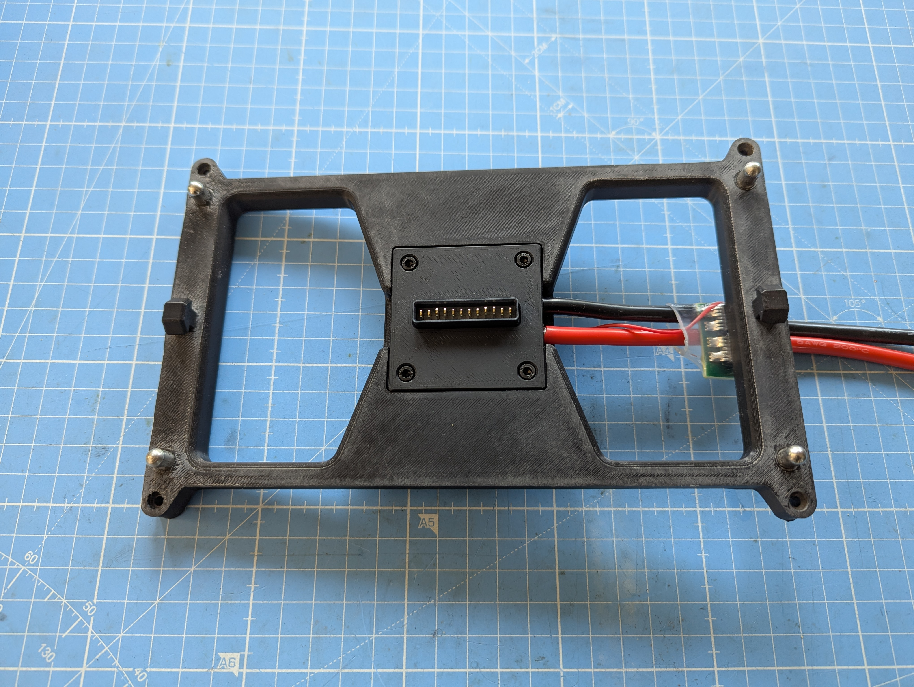
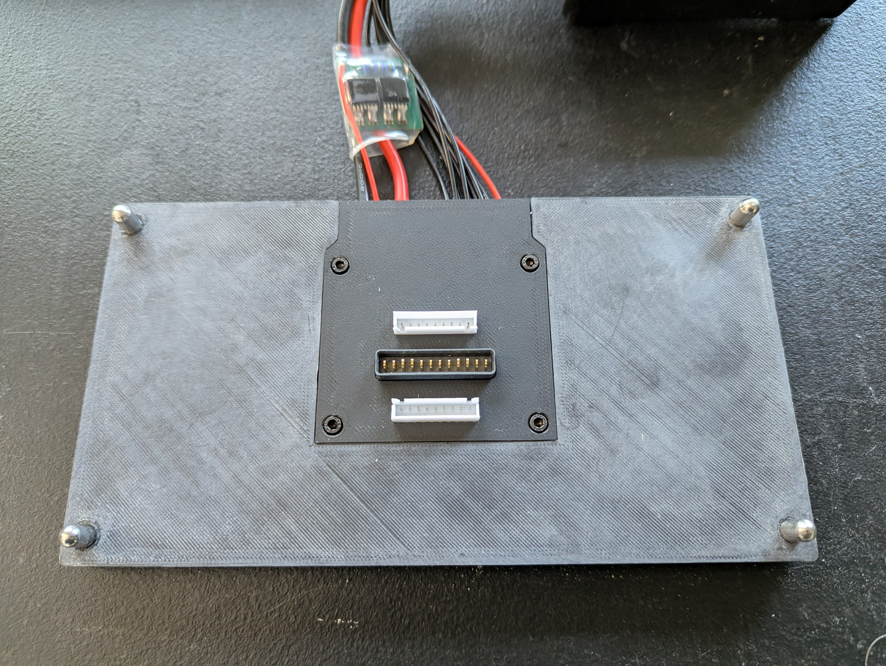

# DIY 21700 Battery System Kit Info
## What You Get
Each kit comes with:
* a prebuilt vehicle adapter
  

    
  

  
* a prebuilt charging station
  

    
  

  

* all parts needed to build the battery
  - frames
  - top plate
  - bottom plate
  - pre-built end plates
  - battery PCB
  - 8 AWG wires
  - 6mm bullet connectors
  - pre-wired JST-XH connectors
  - prepared busbars
  - 21700 insulator rings

* step-by-step instructions

> IMPORTANT NOTE: kit **<ins>does NOT come with 21700 cells: you must select and purchase these on your own. Additionally, spot welding and hand soldering is required to build the battery</ins>**.

## Pricing
Suppose that the battery system configuration is given by
**M**s**N**p\
where\
**M** = number of cells in series\
**N** = number of cells in parallel

Then, the pricing scheme is as follows:\
Total price = $5 * **M** * **N**

The table below shows the kit price according to configuration:

|| 6s | 8s | 10s | 12s |
| :--- | :--- | :--- | :--- | :--- |
| 3p | $90 | $120 | $150 | $180 |
| 4p | $120 | $160 | $200 | $240 |
| 5p | $150 | $200 | $250 | $300 |
| 6p | $180 | $240 | $300 | $360 |

## Ordering Info
The e-commerce site for purchasing kits is still being developed and should be ready by early October 2026. However, if you are interested in buying a kit, please send an email to **DIY21700BatterySystem@gmail.com** with the following:
* Subject line:\
  "**M**s**N**p Battery System Kit Interest"\
  where\
  **M** = number of cells in series\
  **N** = number of cells in parallel
  
* Body:\
  "Please notify me when this kit is available"

I will try to respond to these inquiries as soon as possible.
