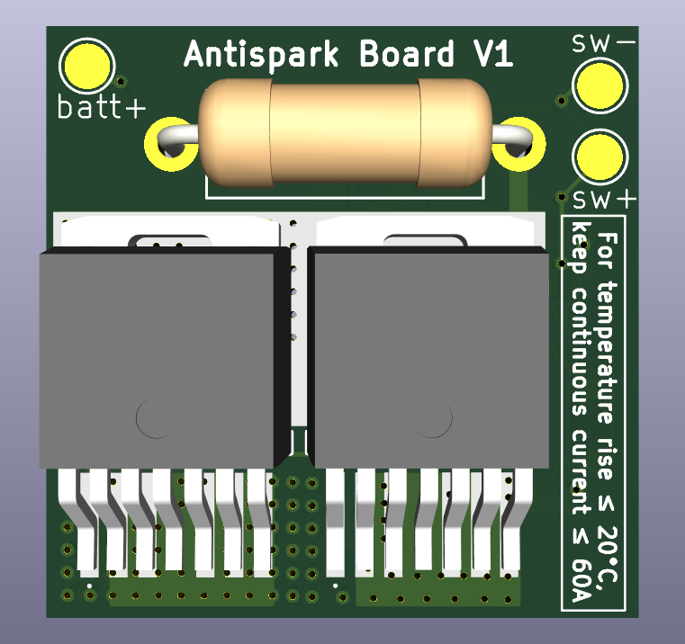
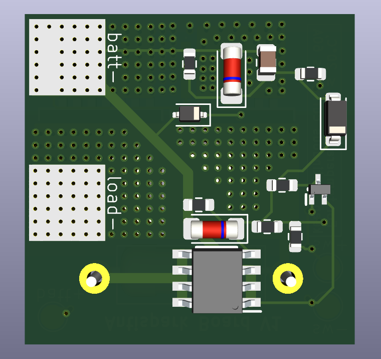

## KiCad 3D View
Below are the screenshots of this board from KiCad's 3D board viewer.

  
  

## BOM
| References | Value | Footprint | Quantity |
| --- | --- | --- | --- |
| C1 | 4.7 μF | C_0805_2012Metric | 1 |
| R1, R2, R4, R5 | 1 MΩ | R_0603_1608Metric | 4 |
| R3 | 4.7 Ω | R_Axial_DIN0414_L11.9mm_D4.5mm_P15.24mm_Horizontal | 1 |
| R6 | 100 kΩ | R_0603_1608Metric | 1 |
| R7 | 100 Ω | R_0603_1608Metric | 1 |
| D1, D2 | 12 V | D_MiniMELF | 2 |
| D3 | Zener 0.5 V | D_SOD-123 | 1 |
| D4 | 10 V | D_SOD-323 | 1 |
| Q1, Q2 | IRFS7530TRL7PP | IRFS7530TRL7PP | 2 |
| Q3 | FDS5670 | SOIC127P600X175-8N | 1 |
| Q4 | NTA4001NT1G | SOT50P160X90-3N | 1 |

## How to Purchase the Board and Components
To purchase PCBs, take the zipped 'fab' directory containing the PCB manufacturing instructions and upload it to a PCB manufacturer's website (e.g. JLCPCB or PCBWay)

To purchase components, open the [ibom](bom/ibom.html) in your web browser and purchase the components in the required quantity from either Digikey or Mouser
