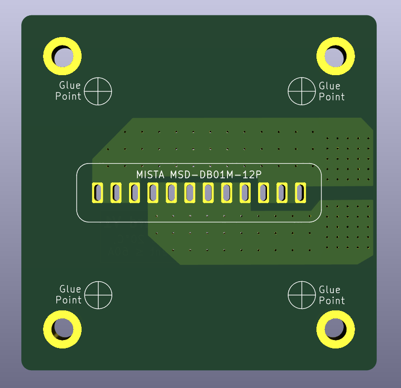
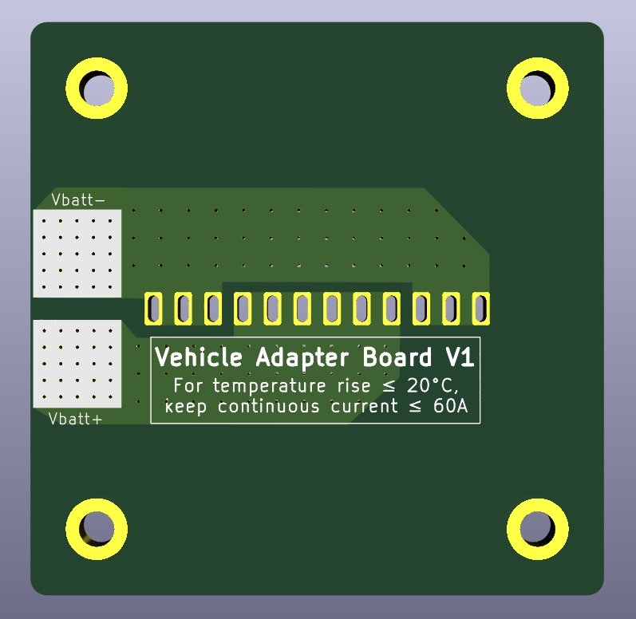

## KiCad 3D View
Below are the screenshots of this board from KiCad's 3D board viewer.

  
  

## How to Purchase the Board and Components
To purchase PCBs, take the zipped 'fab' directory (which contains PCB manufacturing instructions) and upload it to a PCB manufacturer's website (e.g. [JLCPCB](https://JLCPCB.com) or [PCBWay](https://PCBWay.com))
