# Vehicle Adapter Build Instructions

## Outline
1. 3D Print the Parts
2. Assemble the Vehicle Adapter Board
3. Assemble the Vehicle Adapter

---

## 1) 3D Print the Parts

| Part | Quantity | Filament | Print Settings |
| :--- | :--- | :--- | :--- |
| Vehicle adapter body | 1 | black ASA | 15% infill, requires 15 mm outer brim |
| Vehicle adapter cover | 1 | black ASA | 15% infill |
| Latch | 2 | black ASA | 100% infill |

---

## 2) Assemble Vehicle Adapter Board

2.1) Super glue a MISTA 12-pin male connector to the vehicle adapter board (plastic-to-board contact, don't glue the metal contacts!)

  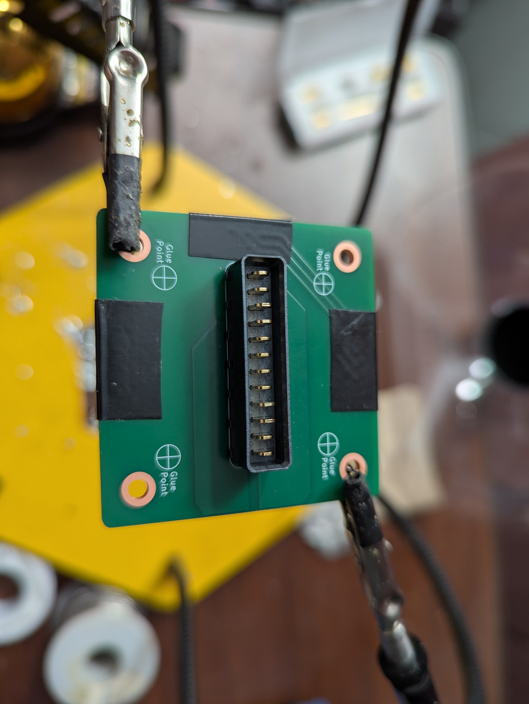

2.2) Solder the connector to the board\

  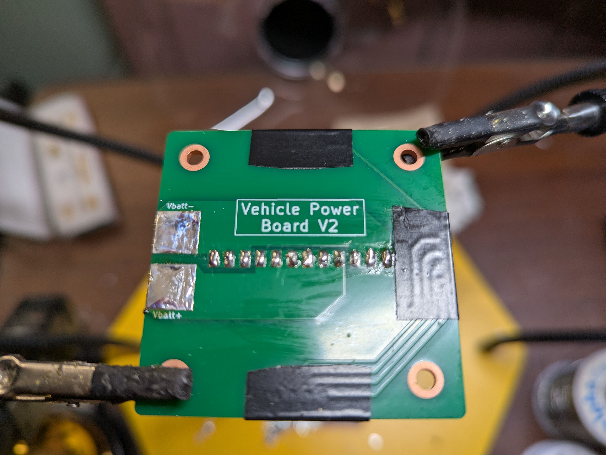

2.3) Cut a black 8 AWG wire to 70 mm & solder to the antispark board 'batt-' terminal

  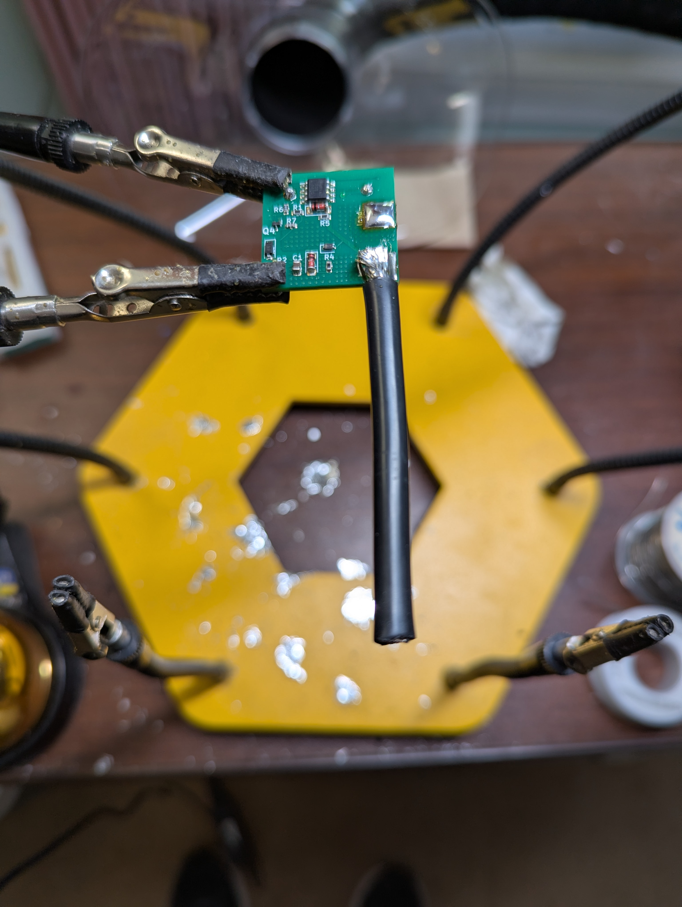

2.4) Cut a black 8 AWG wire to 128 mm & solder to the antispark board 'load-' terminal

  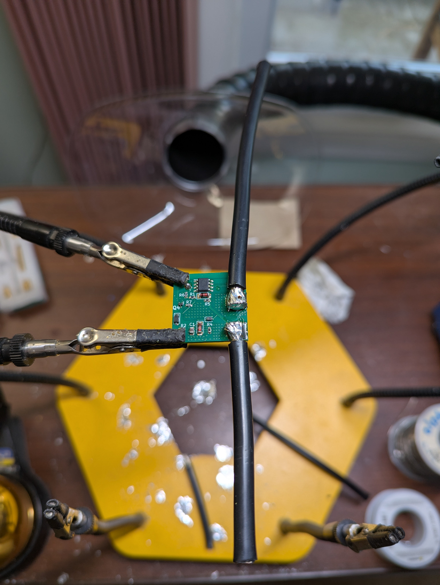

2.5) Cut a red 22 AWG wire to 90 mm & solder to the antispark board 'batt+' terminal

  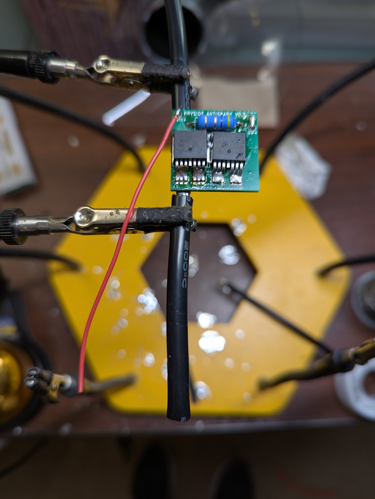

2.6) Solder the black 8 AWG wire coming off the antispark board 'batt-' terminal to the vehicle adapter board 'Vbatt-' terminal

  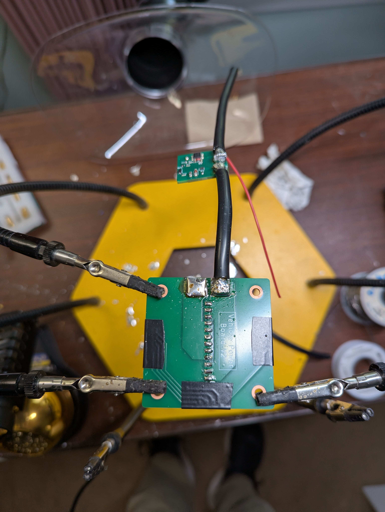

2.7) Cut a red 8 AWG wire to 200 mm length & solder it to the vehicle adapter board 'Vbatt+' terminal

  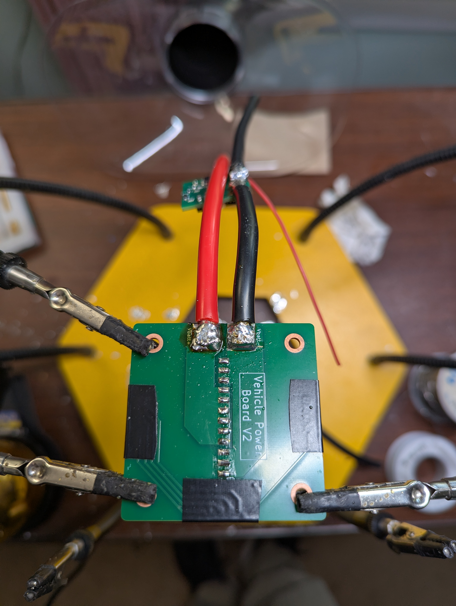

2.8) Solder the red 22 AWG wire coming off the antispark board 'batt+' terminal to the vehicle adapter board 'Vbatt+' terminal

  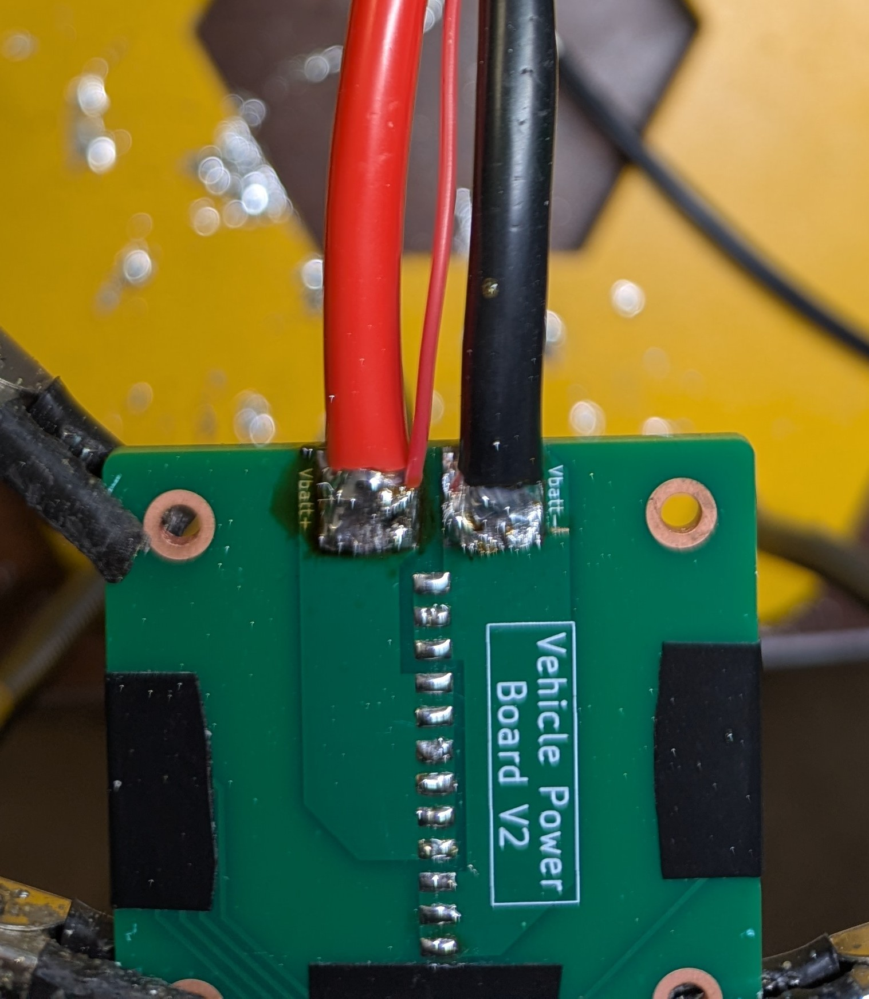

2.9) Place a large, clear heat shrink tube over the antispark board & shrink it down

  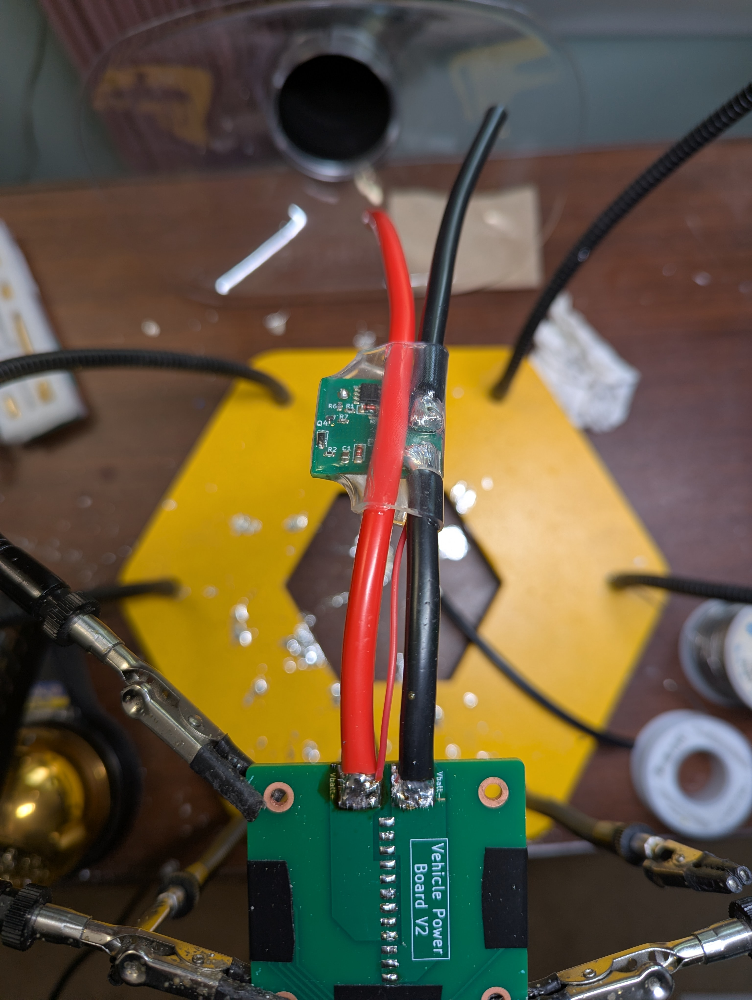

2.10) Place dabs of glue at the glue points on the vehicle adapter board, then glue the cover to it

  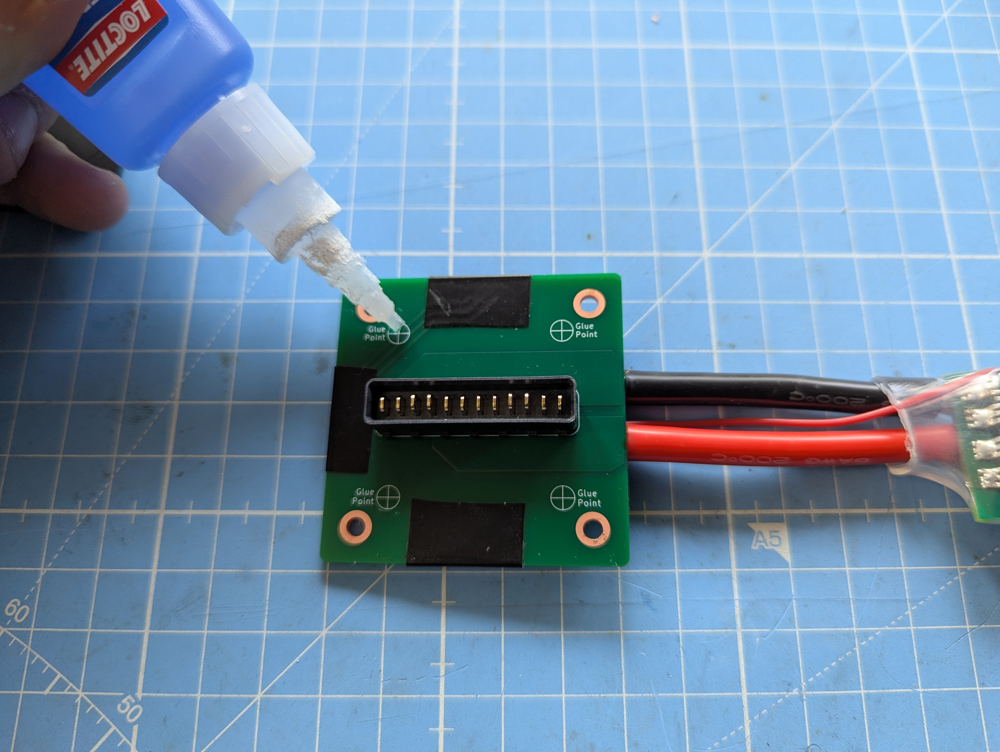
  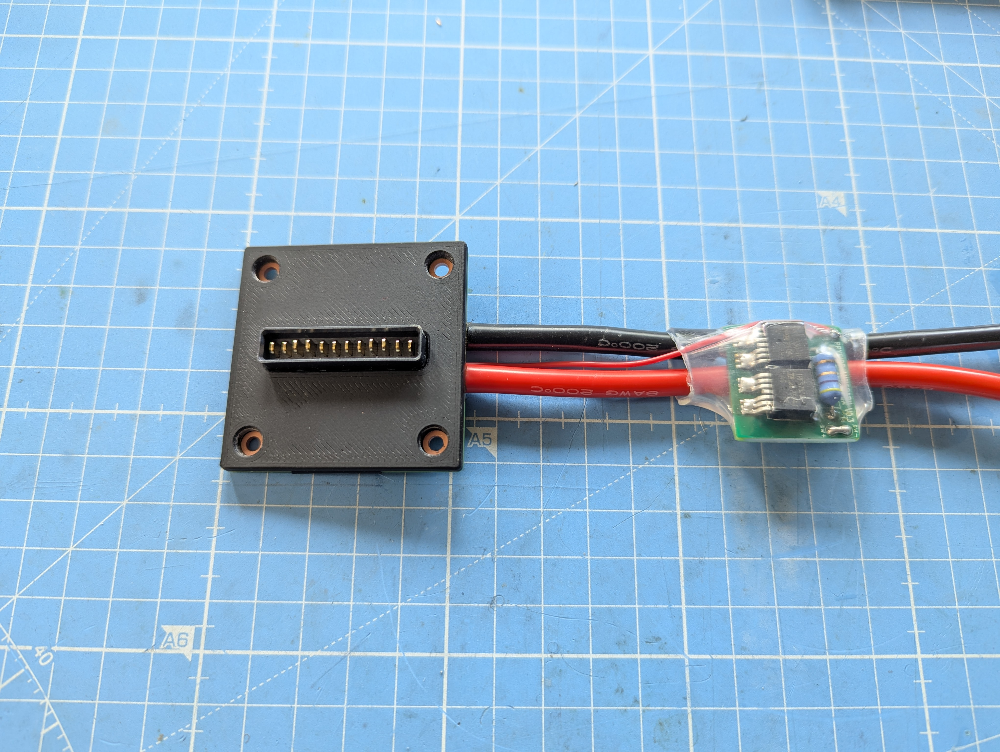

*This concludes the vehicle adapter board build*

> **NOTICE:** the XT90 connector remains separate from the 8 AWG wires protruding from the vehicle adapter board. The proper wire length will be determined upon bolting the vehicle adapter onto the vehicle, at which time the wires can be trimmed to length & soldered to the XT90 connector.
> 

>  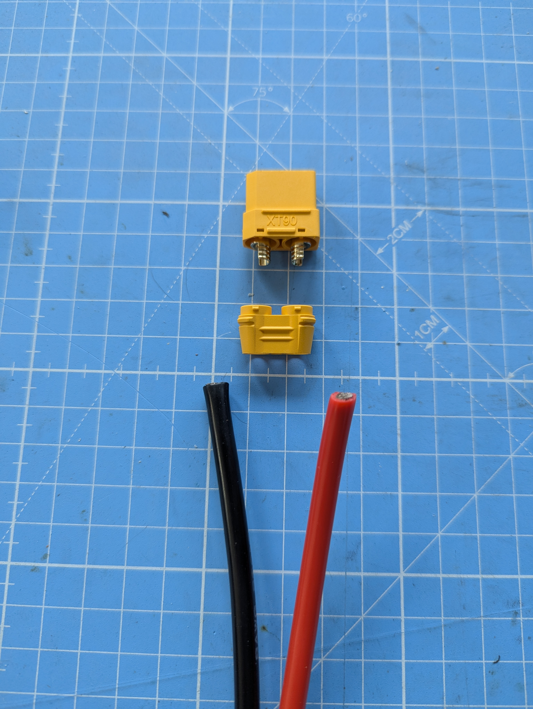
>

---

## 3) Assemble the Vehicle Adapter

3.1) Insert the rounded dowel pins into the 3D-printed vehicle adapter body

  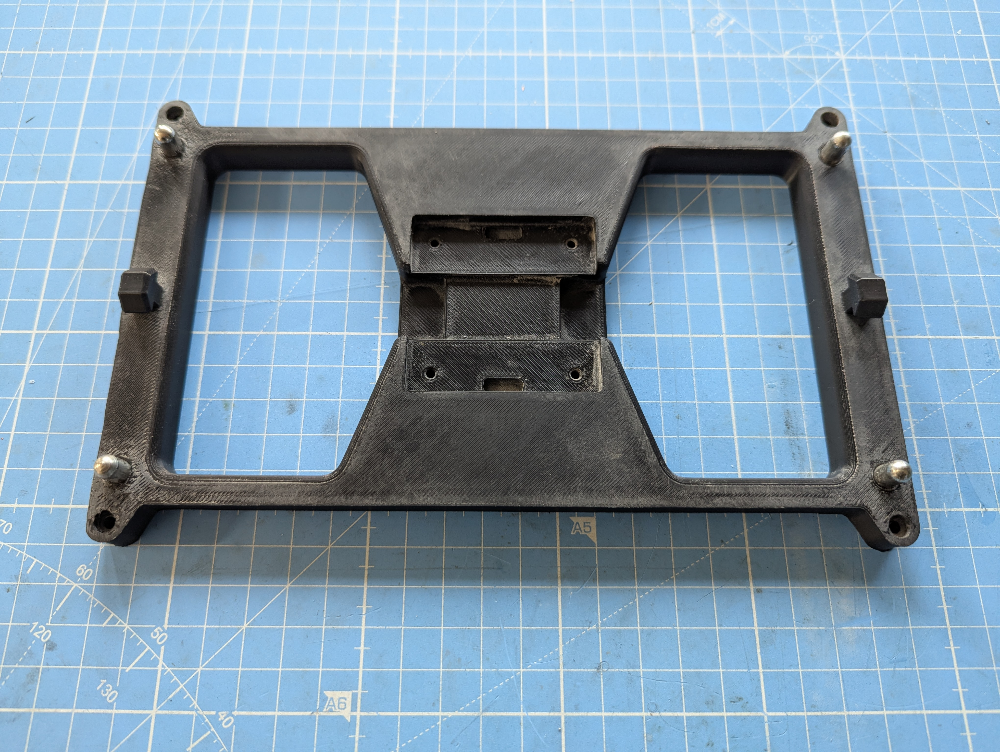

3.2) Insert the vehicle adapter board into the vehicle adapter body, & fasten using four M3 × 6 mm bolts

  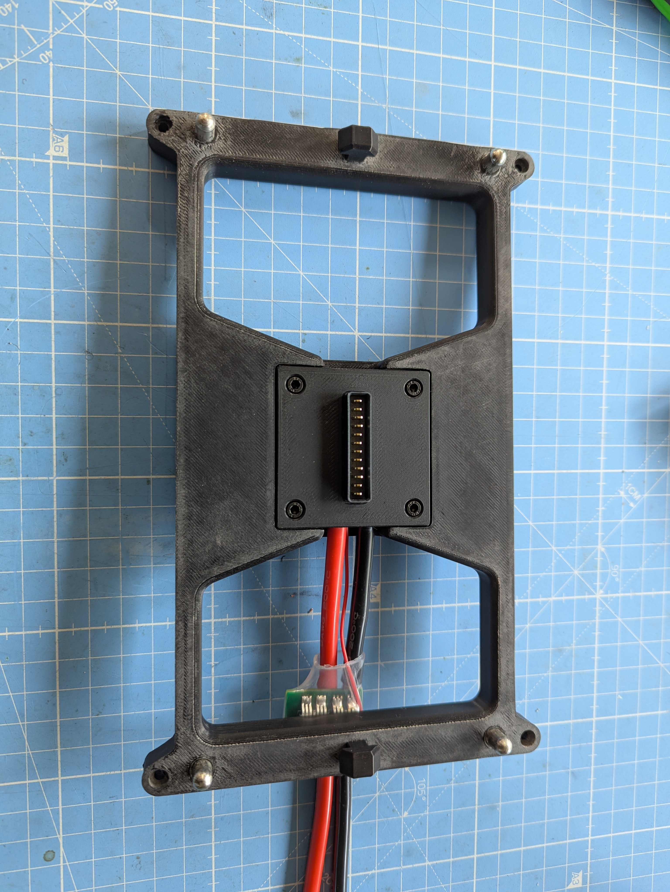

*This concludes the vehicle adapter build*
