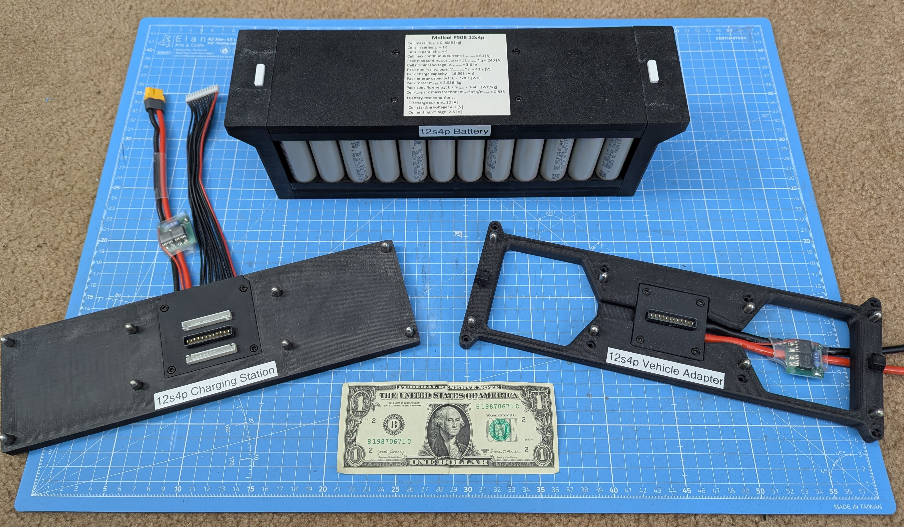

# DIY-21700-Battery-System
## Overview
This is a do-it-yourself battery system intended for use with Unmanned Aerial Vehicles or Unmanned Ground Vehicles.

It consists of...

1) a battery using lithium ion 21700-form-factor cells, with battery configurations spanning from 6s3p to 12s6p
2) a vehicle adapter with place-to-lock/press-to-unlock latching mechanism
3) an off-vehicle charging station

(12s4p charging station shown below)
   

      
   

**This is a complete and working system, with all design files provided for your use:**\
Multiple battery system configurations have been built and flight tested. Additionally, all CAD models have been 3D printed to ensure they work as intended. Finally, if none of the configurations presented here suit your needs then you can create your own battery configuration, since all CAD files (Solidworks part files and STLs) and PCB design files (KiCad project files) are included here for your use.

## Purpose
The parametric nature of this system allows designing and building a battery system specific to your vehicle's requirements. As such, **the value add of this system is threefold:**
1) you can use cells of your choice (i.e., can optimize for either power output or energy capacity) in a configuration suitable for your vehicle's operating envelope
2) you can enjoy a significant cost savings (~50% discount at the time of this writing) by building it yourself (see 'Bill of Materials' section for cost info)
3) the battery's latching mechanism presents a common interface for battery swapping (either manually or by robot arm); this is important since battery swapping vastly increases system uptime when compared with on-board charging

## Battery Mounting Choice
This battery system is designed such that the battery itself is top-mounted onto the vehicle its powering (and top-mounted onto its charging station). This mounting method was chosen to simplify battery swapping (either by human hand or by robot gripper); the process to swap the battery is as follows:
1. get within close proximity of the battery
2. translate grippers directly over the battery
3. rotate grippers to be aligned with the battery end plates
4. translate grippers underneath each end plate ledge
5. close grippers such that the end plate buttons are pressed down, thus unlatching the battery from the vehicle adapter
6. lift battery away from the vehicle
7. carry battery to its charging station

A similar, but reversed, process occurs for taking a fully charged battery off its charging station to the vehicle.

If you intend for such a battery to power your multirotor you might ask: "wouldn't the multirotor be top heavy, thereby adversely affecting stability and control?". The simple answer is no, it wouldn't **if you mount the battery directly above the bulkhead where the motor arms are mounted to the body**. In doing this, the center of mass would be nearer the thrust plane (i.e. the plane where the rotors spin), so there wouldn't be any stability or control issues. Additionally, if the aforementioned multirotor configuration is used, then a bottom mounted payload shifts the center of gravity downward. As final proof of functionality, I have personally flight tested a multirotor using a 12s4p battery, with no stability or control issues whatsoever.

[PUT IMAGE OF 12s4p RESEARCH QUADCOPTER HERE]

## Cell Form Factor Choice
Considering the cell form factor, **21700 cells** (i.e. cylindrical cells having 21[mm] height and 70[mm] length) **are used in the battery since they are cheap, easily obtained, and have high gravimetric energy density**. In comparison to other cells types, 18650 cells tend to have lower gravimetric energy density, while 4680 cells, prismatic cells, and pouch cells aren't widely available to the general public (as of late 2026). Concerning battery design, the battery configuration is defined by its number of cells in series (which sets its voltage) and its number of cells in parallel (which sets its charge capacity and its max current draw limit). In the system presented here, the possible number of cells in series ranges from 6 to 12, while the possible number of cells in parallel ranges from 3 to 6. That is, the smallest possible battery configuration is one having 6 cells in series and 3 cells in parallel (18 cells total), while the largest battery configuration is one having 12 cells in series and 6 cells in parallel (72 cells total).

[PUT IMAGE OF 12s6p AND 6s3p BATTERY SYSTEMS HERE]

## Safety
Additionally, safety is paramount. A temperature sensor circuit consisting of a microcontroller and busbar voltage sensing is in progress (I had assumed thermistors would work in the cell failure detection role, but apparently the thermal mass of the busbar is too large to detect it in time). I am in the process of designing and prototyping a circuit which detects voltages at each busbar and sends them in MAVLink packets over UART to the flight controller (running either Ardupilot or PX4), with options of alerting the pilot or autolanding the vehicle if a measured busbar voltage is lower than some threshold. **The software development, physical packaging, and testing have posed significant issues which require a non-trivial amount of iteration, time, and money: I am working through these issues, but at some point I need to call a "pencils down" and declare victory, so Version 1 is without this safety feature. However, I assure you that Version 2 will have this safety feature, so stay tuned for that.** Additionally, I am in the process of making a low voltage alarm circuit featuring a buzzer and orange LED lights which buzz and flash upon low voltage detection, which I intend to include in Version 2 of this project.

Concerning the electrical system limitations, the PCBs (the 'Battery Board', 'Vehicle Adapter', and 'Antispark Board') are designed to handle 60 amps of continuous current (assuming a maximum temperature rise of 20°C). **You should consider the 60 amps of continuous current limitation as the primary limiting factor in your selected configuration.** This current limitation is written out on each PCB via silkscreen text. Note that this is max continuous current, <ins>not max short-duration current</ins>: max short-duration current is dictated by the 21700 cell you choose (should be listed in its datasheet) and the number of cells used in parallel. Specifically, the max short-duration current limitation is given by:

$I_{max\ total,short\ duration}$ = $I_{max\ cell} * N$\
where\
$N$ = number of cells in parallel

## DIY or Build from a Kit
Building this system consists of many steps (see 'Build Steps' section), and requires specific tools (see 'Required Tools' section). As a consequence, many people may find that doing this on their own is too advanced for them. Therefore, a kit is available to make the the build process easier: in essence, all you need to do upon receiving the kit is
1) spot weld the terminals of your favorite cells (purchased separately) to the pre-wired bus bars
2) fasten the fully-prepared 3D printed parts and pre-populated PCBs together with screws
3) Test the battery by performing a few charge/discharge cycles on your battery charger (the battery charger is not included in the kit)
Then, the tools required for building the battery system from the kit is
1) a suitable spot welder
2) metric hex wrenches
3) a suitable battery charger

If you are interested in buying a kit, I am selling kits for each configuration at prices listed in this table [PUT LINK TO PRICE TABLE HERE]. If you are interested, please email <ins>DIY21700BatterySystem@gmail.com</ins> with the subject line found in the table.

Whether you are building from raw materials or building from the kit, pictures and descriptions are provided at each step to aid in the build process.

## Battery System Components in Detail
The battery system consists of the following components:
1) the battery
2) the vehicle adapter
3) the charging station (<ins>please note that this connects to a standard RC battery charger, and is not a charger itself: its an interface between the battery and the charger</ins>)

Each component is sized according to the chosen battery configuration. Possible battery configurations range from 6 to 12 cells in series, and 3 to 6 cells in parallel. Spelled out, these configurations are:
* Six in series:
    - Three in parallel (21700_6s3p)
    - Four in parallel (21700_6s4p)
    - Five in parallel (21700_6s5p)
    - Six in parallel (21700_6s6p)
* Eight in series:
    - Three in parallel (21700_8s3p)
    - Four in parallel (21700_8s4p)
    - Five in parallel (21700_8s5p)
    - Six in parallel (21700_8s6p)
* Ten in series:
    - Three in parallel (21700_10s3p)
    - Four in parallel (21700_10s4p)
    - Five in parallel (21700_10s5p)
    - Six in parallel (21700_10s6p)
* Twelve in series:
    - Three in parallel (21700_12s3p)
    - Four in parallel (21700_12s4p)
    - Five in parallel (21700_12s5p)
    - Six in parallel (21700_12s6p)

## Steps for Selecting a Battery Configuration
In general,\
**The number of cells in series determines the battery voltage:**\
$battery\ max\ voltage = (cell\ max\ voltage) * (number\ of\ cells\ in\ series)$\
where\
$cell\ max\ voltage$ = 4.1 V (for LiIon cells)

**The number of cells in parallel determines the battery charge capacity:**\
$$battery\ charge\ capacity = (cell\ expected\ charge\ capacity) * (number\ of\ cells\ in\ parallel)$$\
where\
$cell\ expected\ charge\ capacity$ = a function of expected average current draw in cruise (fixed wing) or hover (VTOL)

Specifically, to find the cell's expected charge capacity, check its datasheet for the plot of Voltage vs Charge Capacity (which contains curves of various discharge rates) and then match your vehicle's expected average current draw to the corresponding discharge rate curve in the plot. Finally, find the capacity corresponding to an "empty" voltage of around 2.8 V.

For a multirotor, the appropriate battery configuration can be determined using this [multirotor design methodology](Misc/Multirotor_Design_Methodology.md).

## Required Tools
* Soldering iron (for general soldering)
* Threaded insert soldering iron tip 
* Hot plate (for SMD soldering)
* Spot welder (for battery bus bar welding)
* 3D printer
* Deburr tool (for removing edge artifacts from 3D prints)
* Wire stripper
* Wire cutter
* Super glue
* Sheet metal shears (for cutting busbars)
* Hand drill or drill press (for cutting wire pass-through holes into busbars)

## Bill of Materials (BOM)
### Battery BOM
[COMPLETE THIS]

### Vehicle Adapter BOM
[COMPLETE THIS]

### Charging Station BOM
[COMPLETE THIS]

## Build Steps
### Things you should know before starting:
* ASA filament is used for 3D printing all the parts because it is ultraviolet resistant, so it can be left outdoors without degrading in strength. However, 3D printing it releases toxic fumes (specifically, printing it releases volatile organic compounds along with ultrafine particles, either of which may be carcinogenic), so use a fan-filter system when printing ASA. Also, ASA is prone to warping and so must be printed in a heated enclosure. Even with a heated enclosure, a brim is often needed on large parts to keep them from peeling away from the print bed. If the peeling at edges occurs at any time during the print, its a failed print so cancel it and reprint it with a 5 mm increase to the brim width. Do this iteratively until the print is successful.
* The printed circuit boards (PCBs) can be manufactured by uploading the zipped gerber files (provided in the repo) to a PCB manufacturer, such as PCBWay or JLCPCB
* The PCB components can be purchased from electronic component suppliers, such as DigiKey or Mouser, but know that you will need to hand-solder the through-hole components and hot plate solder the SMD components
* The build process is very frustrating and time-consuming, especially
   - 3D printing the parts, with ASA prints likely to fail due to warping
   - populating the antispark circuits with SMD components and soldering them using a hot plate
   - cutting wires to length and soldering them
   
   To save time and frustration, pre-made kits for each battery configuration are available for purchase: see 'Overview' section for details on ordering a kit
  
### To make the battery system build process as simple as possible, proceed in the following order:
  1. Decide on a battery configuration
  2. Order the required PCBs: each system needs two antispark PCBs [LINK HERE], one configuration-specific charging station PCB [LINK HERE], one configuration-specific battery PCB [LINK HERE], and one vehicle adapter PCB [LINK HERE]
     Additionally, order the antispark components [LINK TO ANTISPARK BOM] (use Digikey or Mouser for these items) and the parts listed in the BOM for each component.
  4. Build the antispark boards: [PUT LINK TO BUILD STEPS HERE]
  5. Build the charging station: [PUT LINK TO BUILD STEPS HERE]
  6. Build the battery: [PUT LINK TO BUILD STEPS HERE]
  7. Build the vehicle adapter: [PUT LINK TO BUILD STEPS HERE]
  8. Integrate vehicle adapter into vehicle
  9. Perform vehicle operating envelope testing

## IMMEDIATE TO DO
* Write out build steps and include pictures here
* Add CAD files
* Add PCB design files (KiCad project files)
* Add PCB fabrication files (gerber)
* Clean up this README and repository to make it easy to understand (for examples of GitHub repos with clear documentation see https://github.com/sabogalc/KiCad-Arduino-Boards/tree/main and https://github.com/roboninecom/SO-ARM100-101-Parallel-Gripper)

## VERSION 2 TO DO
* implement the voltage sensing functionality and report over MAVLink via UART
* Implement temperature measurement via two thermistors and report over MAVLink via UART
* rework the end plate latching mechanism, which in its current form unlatches by pinching from the side, with a latching mechanism that unlatches by pinching from the top: this would facilitate ingress to/egress from the top surface, but requires load bearing on the interior top and bottom of the latching mechanism cutout. The point is to make it easy to vertically lift away/toward a sky-facing cutout in an airframe, such that the battery is suitable for use in a fixed-wing UAV. The current manifestation, where lifting from side handles, precludes this possibility. Keep in mind that it must be robot-gripper friendly for automated battery swapping, but also human hand compatible.
* Complete the battery low voltage alarm circuit (flashing orange LED lights and loud buzzer) and add the details to this project
* Replace JST-XH connector interface (used between battery and charging station/vehicle adapter) with machine pin headers

## VERSION 3 TO DO (TENTATIVE)
* make an automated battery swapping system composed of a robot arm with a gripper and some way to precisely orient the gripper to actuate the latching mechanism on the battery (maybe can use RTK GPS to make the vehicle position very accurate, move robot arm over that position, then have a camera on the robot arm find an ArUco target located next to the battery and use it to 1) orient the gripper, 2) center gripper over battery)
* Eliminate balance pins entirely (such as Tattu Plus DroneCAN battery): the battery would instead have an internal battery management system that broadcasts telemetry (real-time individual cell voltages, cycles, capacity, and temperature) directly onto a Controller Area Network (CAN) bus (use DroneCAN protocol?). The charger would reads this data dynamically to manage current distribution safely. See https://ardupilot.org/copter/docs/common-tattu-dronecan-battery.html?st_source=ai_mode
* Extend battery configuration to 24 cells in series (~100V). Requires extra safety precautions for creepage and redesign of PCBs, specifically MOSFETs in antispark circuit
